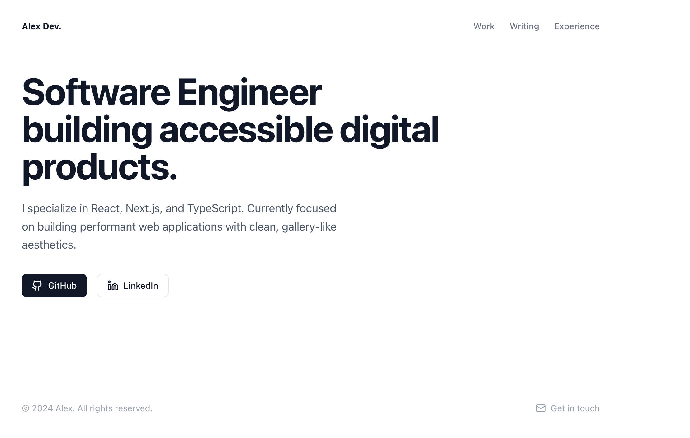

# Personal Portfolio & Digital Garden

A minimalist, high-performance personal website built to showcase my projects, professional experience, and writing. Designed with a "Swiss Style" aesthetic, focusing on typography, whitespace, and accessibility.



## 🚀 Tech Stack

This project uses the latest modern web technologies (Late 2025 Standard):

- **Framework:** [Next.js 15](https://nextjs.org/) (App Router)
- **Language:** [TypeScript](https://www.typescriptlang.org/)
- **Styling:** [Tailwind CSS v4](https://tailwindcss.com/) (No config file, CSS-first configuration)
- **Content:** Markdown (processed via `remark` & `gray-matter`)
- **Typography:** `Geist` & `Inter` (Optimized via `next/font`)
- **Icons:** [Lucide React](https://lucide.dev/)
- **Deployment:** Vercel

## ✨ Features

- **Minimalist Design:** Clean, gallery-style layout with high-contrast typography.
- **Static Blog Engine:** Writes posts in Markdown (`.md`), renders as static HTML at build time.
- **Performance:** 100/100 Lighthouse score, fully responsive, and accessible.
- **Experience Timeline:** specialized layout for CV/Resume history.
- **Typography Plugin:** Beautifully formatted long-form writing using Tailwind Typography.

## 🛠️ Getting Started

### Prerequisites

- Node.js (v18 or higher)
- npm or yarn

### Installation

1. **Clone the repository**

   ```bash
   git clone https://github.com/[your-username]/[repo-name].git
   cd [repo-name]
   ```

2. **Install dependencies**

   ```bash
   npm install
   ```

3. **Run the development server**

   ```bash
   npm run dev
   ```

4. Open [http://localhost:3000](http://localhost:3000) in your browser.

## 📂 Project Structure

```bash
├── app/                  # App Router pages
│   ├── blog/             # Blog listing & dynamic [slug] pages
│   ├── experience/       # Resume/Timeline page
│   ├── work/             # Project gallery
│   ├── globals.css       # Main CSS (Tailwind v4 Setup)
│   └── page.tsx          # Homepage
├── lib/
│   └── posts.ts          # Logic to parse Markdown files
├── posts/                # Local storage for blog content (.md files)
└── public/               # Static assets (images, icons)
```

## 📝 Writing a New Blog Post

1. Create a new file in the `posts/` folder (e.g., `my-new-post.md`).
2. Add the required Frontmatter at the top:

```markdown
---
title: "My New Post Title"
date: "2025-12-06"
excerpt: "A short description that appears on the blog index page."
---

# Introduction

Write your content here using standard Markdown...
```

3. Save the file. The site will automatically detect the new post (no restart required in Dev mode).

## 🎨 Tailwind v4 Note

This project uses **Tailwind CSS v4**.

- There is **no** `tailwind.config.ts`.
- Plugins (like `@tailwindcss/typography`) and theme variables are configured directly in `app/globals.css`.

## 🚢 Deployment

This site is optimized for deployment on **Vercel**.

1. Push code to GitHub.
2. Import project to Vercel.
3. Vercel automatically detects the Next.js framework and deploys.

---

© [2025] [JL]. All rights reserved.
